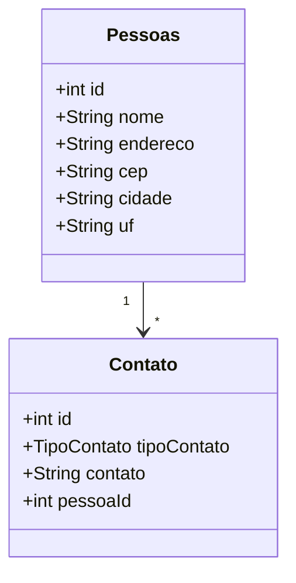

# Sistema de Cadastro e Gerenciamento de Pessoas e Contatos

## Índice
1. [Introdução](#introdução)
2. [Tecnologias Utilizadas](#tecnologias-utilizadas)
3. [Funcionalidades](#funcionalidades)
   - [CRUD de Pessoas](#crud-de-pessoas)
   - [CRUD de Contatos](#crud-de-contatos)
4. [Modelagem de Dados](#modelagem-de-dados)
5. [Estrutura da API](#estrutura-da-api)
6. [Executando o Projeto](#executando-o-projeto)
   - [Passos](#passos)
   - [Banco de Dados](#banco-de-dados)
7. [Documentação e Testes da API](#documentação-e-testes-da-api)

## Introdução
API RESTful desenvolvida para gerenciar pessoas e seus contatos. Ela permite o cadastro, atualização, exclusão e consulta de informações de indivíduos, além de armazenar e organizar seus meios de contato.

## Tecnologias Utilizadas
- Java 21
- Spring Boot 3.4.2
- JPA/Hibernate
- Banco de Dados: H2 (Em memória)
- Swagger (OpenAPI)
- Postman

## Funcionalidades
Funcionalidades da API:

### CRUD de Pessoas
- `POST /api/pessoas`: Cadastra uma nova pessoa.
- `GET /api/pessoas/{id}`: Retorna os dados de uma pessoa por ID.
- `GET /api/pessoas/maladireta/{id}`: Busca uma pessoa pelo ID para mala direta.
- `GET /api/pessoas`: Lista todas as pessoas.
- `PUT /api/pessoas/{id}`: Atualiza os dados de uma pessoa.
- `DELETE /api/pessoas/{id}`: Deleta uma pessoa.

### CRUD de Contatos
- `POST /api/contatos`: Cadastra novo contato.
- `GET /api/contatos/{id}`: Retorna os dados de um contato por ID.
- `GET /api/contatos/pessoa/{idPessoa}`: Lista todos os contatos de uma pessoa.
- `PUT /api/contatos/{id}`: Atualiza um contato existente.
- `DELETE /api/contatos/{id}`: Deleta um contato.

## Modelagem de Dados

As entidades possuem um relacionamento de OneToMany (uma pessoa pode ter muitos contatos) e ManyToOne (cada contato pertence a uma única pessoa). Para seguir as boas práticas de uma API REST, as entidades não são diretamente expostas na camada de controller. Em vez disso, utilizamos DTOs (Data Transfer Objects), que garantem a separação de responsabilidades e melhor controle sobre os dados expostos, proporcionando uma comunicação mais eficiente e flexível entre as camadas da aplicação.


## Estrutura da API

A estrutura da API foi organizada de forma modular para garantir clareza, escalabilidade e manutenção eficiente. A seguir, uma descrição dos principais pacotes e arquivos da aplicação:

- **AppPessoas**: Contém a classe principal responsável por iniciar a aplicação. Esse pacote configura a inicialização da API, carregando as dependências e as configurações essenciais para o funcionamento.

- **Config**: Pacote que contém as configurações específicas da documentação da API. Aqui, são configuradas as ferramentas como Swagger (OpenAPI) para a geração e exibição da documentação da API.

- **Controllers**: Contém as classes responsáveis por gerenciar as requisições HTTP e interagir com os serviços. As classes de controller são responsáveis por receber as entradas dos usuários, processá-las e retornar as respostas apropriadas.

- **Dto**: Este pacote contém as classes de **DTOs (Data Transfer Objects)**. Os DTOs são usados para transferir dados entre as camadas da aplicação, garantindo a separação das responsabilidades e a segurança da exposição das entidades.

- **Enums**: Utilizado no tipoContato da entidade Contato.

- **Exceptions**: Pacote dedicado ao tratamento de exceções. Dentro dele, destaca-se a **HandlerGlobalException**, que centraliza todos os erros personalizados da aplicação, definindo os status HTTP e as mensagens de erro de forma personalizada.

- **Models**: Contém as entidades do sistema: `Pessoas` e `Contato`. Essas classes representam os dados e a estrutura do banco de dados, sendo mapeadas para as tabelas correspondentes.

- **Repositories**: Responsável pela interação com o banco de dados. Contém interfaces que estendem o repositório JPA, facilitando a persistência e recuperação de dados das entidades.

- **Services**: Contém a lógica de negócios da aplicação. As classes de serviço gerenciam a manipulação de dados e a execução das operações complexas, garantindo que as regras de negócios sejam aplicadas corretamente.

- **Validations**: Este pacote é responsável pela validação das entidades antes de serem inseridas no banco de dados. No caso de **Pessoas**, por exemplo, ele valida as informações recebidas antes da persistência, garantindo que os dados estejam corretos e completos.

- **application.properties**: Contém as configurações essenciais para a execução da aplicação, incluindo as credenciais e configurações do banco de dados. Aqui, você pode configurar o banco de dados a ser utilizado (MySQL, PostgreSQL, H2, etc.), além de outros parâmetros de ambiente.

- **data.sql**: Arquivo utilizado para inserir dados iniciais no banco de dados quando a aplicação é iniciada. Esse arquivo pode ser útil para pré-carregar o banco com dados de teste ou configuráveis para o funcionamento da aplicação. (Utilizando banco H2)
  
- **pom.xml**: Arquivo onde contém todas as dependencias necessárias para a API funcionar.


## Executando o projeto

### Passos
1. Clone o repositório:
   ```bash
   git clone https://github.com/yuricn0/api-pessoas-contatos.git 

2. Abra na IDE de sua prefêrencia
- **[Eclipse](https://eclipseide.org/)**
- **[IntelliJ IDEA](https://www.jetbrains.com/idea/download/?section=windows)**
- **[Spring Tool Suite (STS)](https://spring.io/tools)**

3. Compile a aplicação

   ```bash
   mvn clean install
   
4. Execute a aplicação

   ```bash
   mvn spring-boot:run
   
Isso iniciará a aplicação Spring Boot. Se tudo estiver configurado corretamente, você poderá acessar a API no endereço http://localhost:8080

## Banco de Dados

Vá até o pacote src/main/resources e entre no arquivo `application.properties` e veja as credenciais do banco de dados para login e senha. Os campos são:

- spring.datasource.username=(username aqui)
- spring.datasource.password=(senha aqui)

O banco de dados pode ser acessado pelo endereço: http://localhost:8080/h2-console 

## Documentação e Testes da API 

A documentação da API está disponível através do Swagger, uma ferramenta de interface interativa para explorar e testar os endpoints da API.
Após iniciar o projeto, você pode acessar a documentação da API no seguinte endereço: http://localhost:8080/swagger-ui/index.html 
